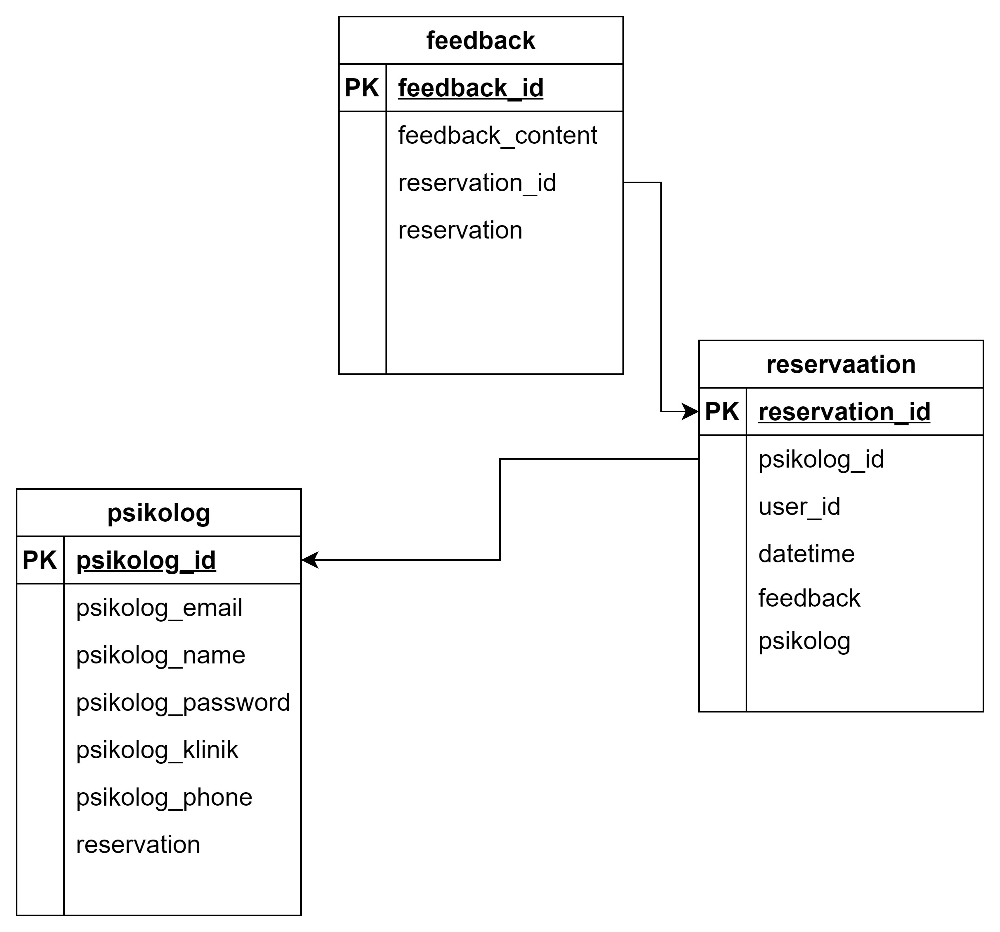

# SayIt-REST

## Deskripsi Singkat
SayIt-REST merupakan backend dari web SayaIt yang dibuat dengan menggunakan express, typescript, dan mysql. SayIt-REST dibuat untuk memenuhi milestone 2 mata kuliah IF3110 Pemrograman Aplikasi Berbasis Web.

## Skema Basis Data
 

## Endpoint API
- GET /user/consultation digunakan untuk menampilkan daftar psikolog
- POST /user/reservation digunakan untuk membuat reservasi dengan psikolog
- POST /psikolog/register digunakan oleh psikolog untuk registrasi
- POST /psikolog/login digunakan oleh psikolog untuk login
- POST /psikolog/feedback/:id digunakan oleh psikolog untuk membuat feedback dari konsultasi
- GET /psikolog/booked/:id digunakan untuk melihat daftar psikolog yang telah direservasi
- PUT /psikolog/update/:id digunakan untuk mengupdate profile psikolog
- DELETE /psikolog/delete/:id digunakan untuk menghapus akun psikolog

## Pembagian Tugas
1. Initial Setup: 13521013
2. Authentication: 13521013 13521014
3. Psikolog Reservation: 13521014
4. User, Psikolog Service: 13521013
5. Configuration: 13521013 13521006